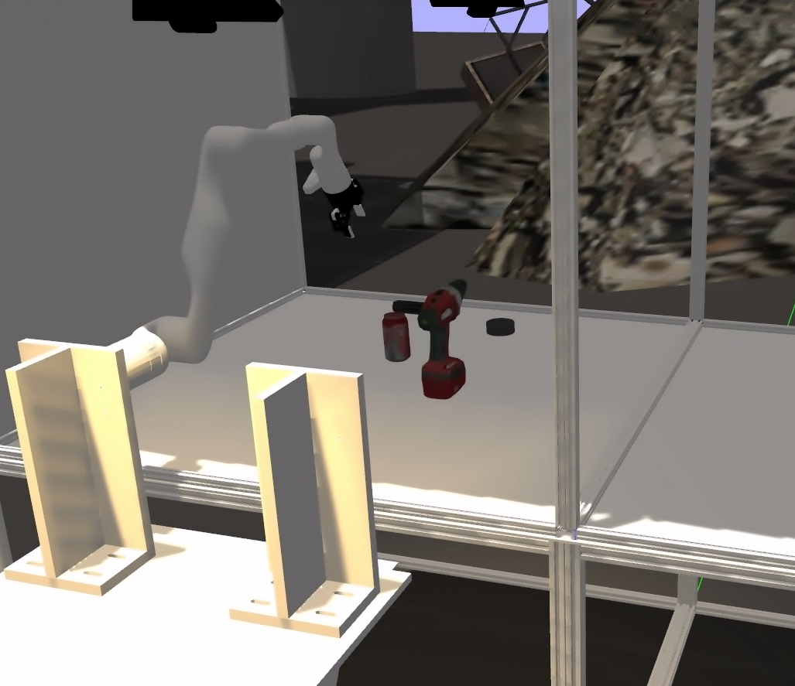
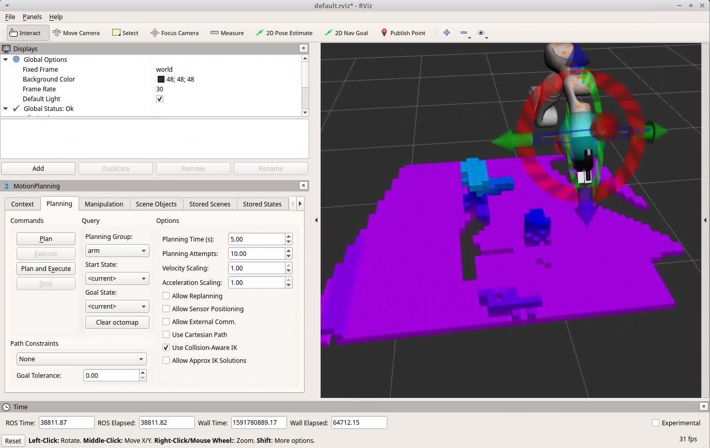

# Glovebox simulator


[](https://zenodo.org/badge/latestdoi/270940490)


## Introduction

A [glovebox](https://en.wikipedia.org/wiki/Glovebox) is a sealed container that is designed to allow manipulation of objects where a separation from the object is desired. Built into the sides of the glovebox are gloves arranged in such a way that the user can place their hands into the gloves and perform tasks inside the box without breaking containment. Part or all of the box is usually transparent to allow the user to see what is being manipulated. Two types of gloveboxes exist. The first allows a person to work with hazardous substances, such as radioactive materials or infectious disease agents, and the second allows manipulation of substances that must be contained within a very high purity inert atmosphere, such as argon or nitrogen. 

One of the biggest risks to operates is the gloves breaking. In order to derisk human-like robots could be used to replace the direct arms in the glovebox.
This can be through tele-operation or through autonomy.



This repo provides a flexible simulation and development environment for controlling robotis in a glovebox to do representative tasks.
This includes:
* A [Gazebo](http://gazebosim.org/) simulation of the environment,
* A modified [Kinova](https://github.com/Kinovarobotics/ros_kortex) setup,
* A [Moveit](https://moveit.ros.org/) configuration.



## Installation

### Setup

- [Robot Operating System (ROS)](http://wiki.ros.org) (middleware for robotics)

This package has been tested under ROS Melodic (Ubuntu 18.04).
You can find the instructions to install ROS Melodic [here](http://wiki.ros.org/melodic/Installation/Ubuntu).


### Build

These are the instructions to run in a terminal to create the workspace, clone the `ros_kortex` repository, install the necessary ROS dependencies and build the package:

        sudo apt install python3 python3-pip
        sudo python3 -m pip install conan
        conan config set general.revisions_enabled=1
        conan profile new default --detect > /dev/null
        conan profile update settings.compiler.libcxx=libstdc++11 default
        mkdir -p catkin_workspace/src
        cd catkin_workspace/src
        git clone https://github.com/ukaea/Glovebox-Simulator.git
        cd ../
        rosdep install --from-paths src --ignore-src -y
        catkin_make
        source devel/setup.bash

As you see, there are instructions to install the Conan package manager. You can learn more about why we use Conan [in this specific section of the kortex_driver readme](kortex_driver/readme.md#conan).

## Usage

The [spawn_kortex_robot.launch file](launch/spawn_kortex_robot.launch) launches the arm simulation in [Gazebo](http://gazebosim.org), with [ros_control](http://wiki.ros.org/ros_control) controllers and optionally [MoveIt!](https://moveit.ros.org/).
The launch can be parametrized with arguments : 

To launch it with default arguments, run the following command in a terminal : 

`roslaunch kortex_gazebo spawn.launch gripper:="robotiq_2f_85"`

To launch it with optional arguments, specify the argument name, then ":=", then the value you want. For example, : 

`roslaunch kortex_gazebo spawn.launch start_rviz:=false use_trajectory_controller:=false`

**Arguments**:
- **start_gazebo** : If this argument is false, Gazebo will not be launched within this launched file. It is useful if you already launched Gazebo yourself and just want to spawn the robot. The default value is **true** (Gazebo will be started).
- **gazebo_gui** : If this argument is false, only the Gazebo Server will be launched. The default value is **true**.
- **start_rviz** : If this argument is true, RViz will be launched. The default value is **true**.
- **gripper** : Name of your robot arm's tool / gripper. See the `kortex_description/grippers` folder to see the available end effector models (or to add your own). The default value is **""**. For Gen3, you can also put **robotiq_2f_85**. 
- **use_trajectory_controller** : If this argument is false, one `JointPositionController` per joint will be launched and the arm will offer a basic ROS Control interface to control every joint individually with topics. If this argument is true, a MoveIt! node will be started for the arm and the arm will offer a `FollowJointTrajectory` interface to control the arm (via a `JointTrajectoryController`). The default value is **true**.
- **use_sim_time** : If this value is true, Gazebo will use simulated time instead of system clock. The default value is **true**.
- **debug** : If this value is true, Gazebo will be launched in debug mode. This option is useful for debugging Gazebo-related issues that won't show in the terminal. The default value is **false**.
- **paused** : If this value is true, Gazebo will be started paused. The default value is **$(arg use_trajectory_controller)** because, when MoveIt! is enabled, Gazebo needs to be started paused to let the controllers initialize.

## Notebooks and Tutorials

Python notebooks are kept in: glovebox_control/notebooks

* Joint Control - Control individual joints - Jupyter and jupyros required  
* MoveIt - Control the robot through move it.

## Attributation

Thanks is given to the developers of https://github.com/Kinovarobotics/ros_kortex as it was key to this work.

## How to Cite

```latex
@misc{lia_corrales_2015_15991,
    author       = {Guy Burroughes},
    title        = {{Glovebox Robotics Simulator}},
    month        = Jun,
    year         = 2020,
    doi          = {10.5281/zenodo.3898208 },
    version      = {1.0},
    publisher    = {Zenodo},
    url          = {https://github.com/ukaea/Glovebox-Simulator}
    }
```
or you can get the bibtex by:
```bash
curl -LH "Accept: application/x-bibtex" https://doi.org/10.5281/3898208
```
